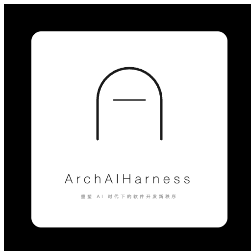

 

# ArchAIHarness
### 重塑 AI 时代下的软件开发新秩序

 

 

🤖 **agent-master** — Agent 控制面 · K8s 调度 · 多租户 ·
[`repo`](https://github.com/ArchAIHarness/agent-master)

📦 **agent-image** — Runtime 镜像 · 无头 + WebUI 双版本 ·
[`repo`](https://github.com/ArchAIHarness/agent-image)

🖥️ **agent-webui** — 基于 OpenSumi 的 Agent IDE ·
[`repo`](https://github.com/ArchAIHarness/agent-webui)

🧩 **agent-plugin** — 插件框架 · Agents · Skills · Tools ·
[`repo`](https://github.com/ArchAIHarness/agent-plugin)

⚙️ **agent-workflows** — 可复用工作流模板集 ·
[`repo`](https://github.com/ArchAIHarness/agent-workflows)

💬 **feishu-bot** — 飞书原生 Agent · 消息桥 · 三道闸 ·
[`repo`](https://github.com/ArchAIHarness/feishu-bot)

🏗️ **framework** — DDD 多租户工程底座 ·
[`repo`](https://github.com/ArchAIHarness/framework)

📝 **技术专栏** — 日均 2 篇 · 已发布 22 篇 ·
[`repo`](https://github.com/ArchAIHarness/zhuanlan-ai-and-agents)

 

---

**人立法 · AI 执行 · 体系审计**

Engineered by Architects · Empowered by AI · Audited by Discipline

