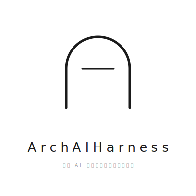

 
 

# 重塑 AI 时代下的软件开发新秩序

 

**人立法 · AI 执行 · 体系审计**

 

---

当 AI 让代码生成变得廉价，架构判断就变得更贵。

我们不把 AI 当成更快的代码生成器。我们把它放在明确的架构边界内，用规则约束执行，用体系确保可审计。

 
ArchAIHarness · Engineered by Architects · Empowered by AI · Audited by Discipline
 

