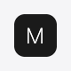
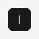

  
<h1 style="margin:0;font-weight:300;letter-spacing:4px">ArchAIHarness</h1>

重塑 AI 时代下的软件开发新秩序

人立法 · AI 执行 · 体系审计

 

<table style="border:none;border-collapse:separate;border-spacing:20px;margin:0 auto">
<tr>
<td align="center" width="240" style="border:none;background:#fafafa;border-radius:16px;padding:24px 16px">
<a href="https://github.com/ArchAIHarness/zhuanlan-ai-and-agents" style="text-decoration:none;color:#1a1a1a">
  
<b style="font-size:14px">看懂 AI 与智能体</b> 
22 篇连载
</a>
</td>
<td align="center" width="240" style="border:none;background:#fafafa;border-radius:16px;padding:24px 16px">
<a href="https://github.com/ArchAIHarness/agent-master" style="text-decoration:none;color:#1a1a1a">
  
<b style="font-size:14px">agent-master</b> 
Agent 控制面
</a>
</td>
<td align="center" width="240" style="border:none;background:#fafafa;border-radius:16px;padding:24px 16px">
<a href="https://github.com/ArchAIHarness/agent-image" style="text-decoration:none;color:#1a1a1a">
  
<b style="font-size:14px">agent-image</b> 
Runtime 镜像
</a>
</td>
</tr>
<tr>
<td align="center" width="240" style="border:none;background:#fafafa;border-radius:16px;padding:24px 16px">
<a href="https://github.com/ArchAIHarness/agent-webui" style="text-decoration:none;color:#1a1a1a">
  
<b style="font-size:14px">agent-webui</b> 
Agent IDE
</a>
</td>
<td align="center" width="240" style="border:none;background:#fafafa;border-radius:16px;padding:24px 16px">
<a href="https://github.com/ArchAIHarness/agent-plugin" style="text-decoration:none;color:#1a1a1a">
  
<b style="font-size:14px">agent-plugin</b> 
插件框架
</a>
</td>
<td align="center" width="240" style="border:none;background:#fafafa;border-radius:16px;padding:24px 16px">
<a href="https://github.com/ArchAIHarness/agent-workflows" style="text-decoration:none;color:#1a1a1a">
  
<b style="font-size:14px">agent-workflows</b> 
工作流模板
</a>
</td>
</tr>
<tr>
<td align="center" width="240" style="border:none;background:#fafafa;border-radius:16px;padding:24px 16px">
<a href="https://github.com/ArchAIHarness/framework" style="text-decoration:none;color:#1a1a1a">
  
<b style="font-size:14px">framework</b> 
DDD 底座
</a>
</td>
<td align="center" width="240" style="border:none;background:#fafafa;border-radius:16px;padding:24px 16px">
<a href="https://github.com/ArchAIHarness/feishu-bot" style="text-decoration:none;color:#1a1a1a">
  
<b style="font-size:14px">feishu-bot</b> 
飞书原生 Agent
</a>
</td>
<td align="center" width="240" style="border:none;background:#fafafa;border-radius:16px;padding:24px 16px">
<a href="https://github.com/ArchAIHarness" style="text-decoration:none;color:#1a1a1a">
  
<b style="font-size:14px">community-*</b> 
社区平台
</a>
</td>
</tr>
</table>

  

ArchAIHarness · Engineered by Architects · Empowered by AI · Audited by Discipline

